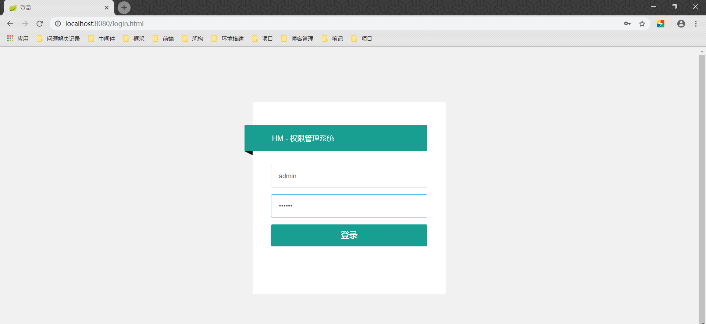
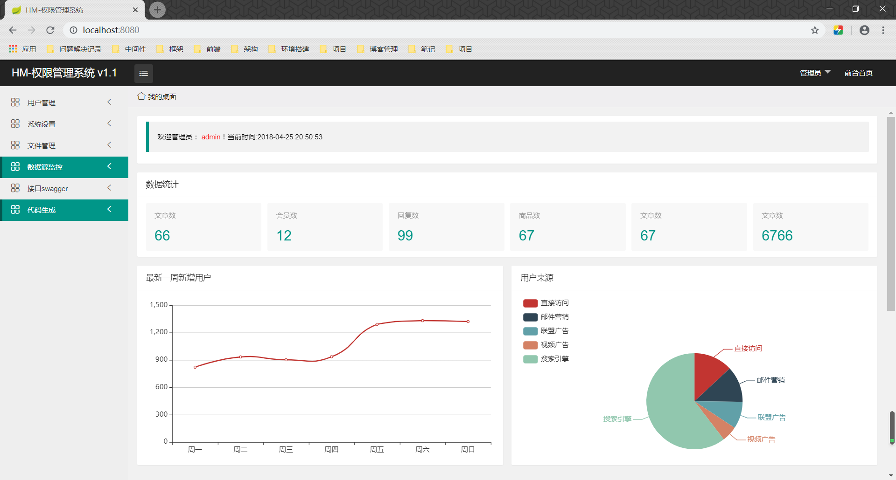
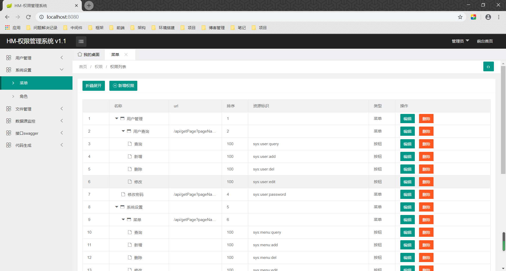
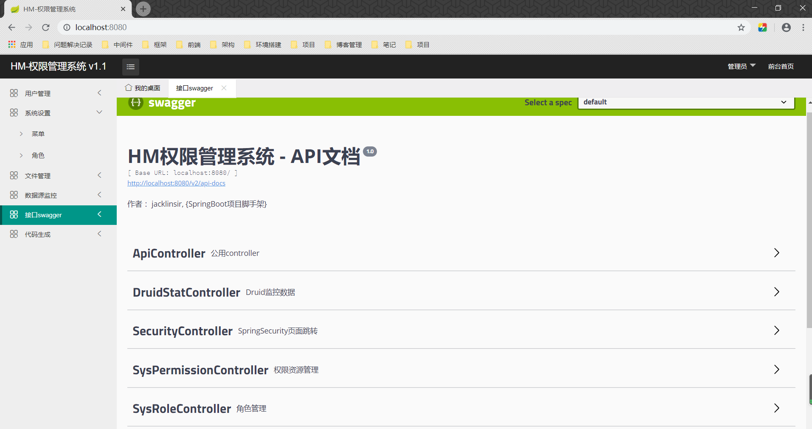
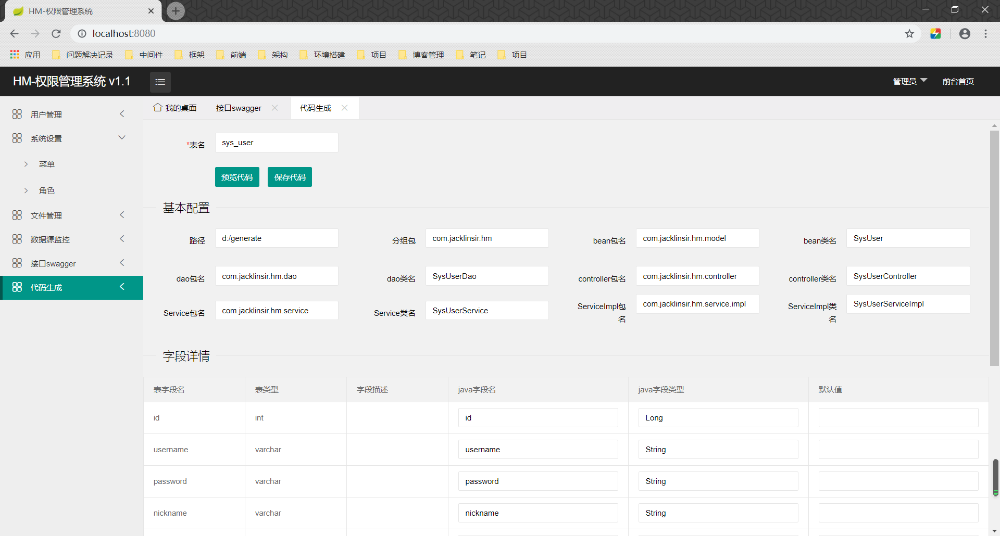

## HM-权限管理系统

#### 项目前言

**HM**项目专门为传统项目打造一个完整后台系统脚架，可以基于本项目快速开发你所需的项目，简单方便。

**项目演示地址:** 

~~等待作者部署上服务器~~

### 项目介绍

<details id="repo-meta-edit" class="Details-element details-reset js-dropdown-details " style="box-sizing: border-box; display: block; color: rgb(36, 41, 46); font-family: -apple-system, BlinkMacSystemFont, &quot;Segoe UI&quot;, Helvetica, Arial, sans-serif, &quot;Apple Color Emoji&quot;, &quot;Segoe UI Emoji&quot;; font-size: 14px; font-style: normal; font-variant-ligatures: normal; font-variant-caps: normal; font-weight: 400; letter-spacing: normal; orphans: 2; text-align: start; text-indent: 0px; text-transform: none; white-space: normal; widows: 2; word-spacing: 0px; -webkit-text-stroke-width: 0px; background-color: rgb(255, 255, 255); text-decoration-style: initial; text-decoration-color: initial;"><summary class="d-block" style="box-sizing: border-box; display: block !important; cursor: pointer; list-style: none;"><div class="Details-content--closed f4" style="box-sizing: border-box; font-size: 16px !important;"><div class="d-flex flex-items-start" style="box-sizing: border-box; align-items: flex-start !important; display: flex !important;"><span class="flex-auto mb-2" style="box-sizing: border-box; flex: 1 1 auto !important; margin-bottom: 8px !important;"><div class="f4" style="box-sizing: border-box; font-size: 16px !important;"><span class="text-gray-dark mr-2" itemprop="about" style="box-sizing: border-box; color: rgb(36, 41, 46) !important; margin-right: 8px !important;">基于SpringBoot框架开发权限管理系统，作为项目中脚手架。技术栈：SpringBoot、SpringSecurity 、MyBatis、thymeleaf、Druid、Hutool工具包、PageHelper、Lombok、swagger2、zTree、TreeTable-Lay等。功能：角色管理，权限资源管理，菜单管理，用户管理，文件管理，系统监控，SQL文件生成，代码生成器等</span></div></span><span class="btn btn-sm" style="box-sizing: border-box; position: relative; display: inline-block; padding: 3px 10px; font-size: 12px; font-weight: 600; line-height: 20px; white-space: nowrap; vertical-align: middle; cursor: pointer; user-select: none; background-repeat: repeat-x; background-position: -1px -1px; background-size: 110% 110%; border: 1px solid rgba(27, 31, 35, 0.2); border-radius: 0.25em; -webkit-appearance: none; color: rgb(36, 41, 46); background-color: rgb(239, 243, 246); background-image: linear-gradient(-180deg, rgb(250, 251, 252), rgb(239, 243, 246) 90%);">Edit</span></div></div></summary></details>
### 项目演示:

后台登入页面：



后台首页:


**列举功能1**

菜单管理:



接口Swagger API文档



在线代码生成功能:



### 技术选型

### 后端技术

| 技术             | 说明                   | 技术官网地址                                                 |
| ---------------- | ---------------------- | ------------------------------------------------------------ |
| SpringBoot       | Spring容器和webMVC框架 | https://spring.io/projects/spring-boot                       |
| SpringSecurity   | 认证和授权框架         | [ https://spring.io/projects/spring-security](https://spring.io/projects/spring-security) |
| MyBatis          | ORM框架                | http://www.mybatis.org/mybatis-3/zh/index.html               |
| MyBatisGenerator | 数据层代码生成         | http://www.mybatis.org/generator/index.html                  |
| PageHelper       | MyBatis物理分页插件    | http://git.oschina.net/free/Mybatis_PageHelper               |
| Swagger-UI       | 文档生产工具           | https://github.com/swagger-api/swagger-ui                    |
| SLF4J            | 日志框架               | http://www.slf4j.org/                                        |
| Docker           | 应用容器引擎           | [https://www.docker.com](https://www.docker.com/)            |
| Druid            | 数据库连接池           | https://github.com/alibaba/druid                             |
| Lombok           | 简化对象封装工具       | https://github.com/rzwitserloot/lombok                       |
| thymeleaf        | 模版引擎               | https://www.thymeleaf.org/                                   |
| Hutool-all       | 通用工具包             | https://hutool.cn/docs/                                      |

#### 前端技术
| 技术          | 描述                     | 技术官网地址                          |
| ------------- | ------------------------ | ------------------------------------- |
| layui         | 前端框架                 | https://www.layui.com/                |
| xadmin        | 前端UI                   | http://x.xuebingsi.com/               |
| zTree         | 菜单树插件               | https://github.com/zTree/zTree_v3     |
| Ajax          | 前端HTTP框架异步请求技术 | https://api.jquery.com/category/ajax/ |
| v-charts      | 基于Echarts的图表框架    | https://v-charts.js.org/              |
| TreeTable-Lay | layui提供插件            | https://www.layui.com/                |

### 项目导入环境
第一你可把数据库导入本地环境。（mysql5.7以上）

第二你如果会docker容器奇数，你可以在docker中安装一个mysql5.7以上镜像。（方便环境隔离）

第三将项目导入IDEA工具中，然后修改application.yml文件，根据自己所需修改指定环境的配置文件。

**1. application.yml**

```yml
spring:
  profiles:
    active: dev #指定配置文件
  devtools:
    restart:
      #需要实时更新的目录
      additional-paths: resources/**,static/**,templates/**
logging:
  path: D://hm-log.log

#配置公共api接口前缀
api-url: /api
```

**2. application-dev.yml**

```java
spring:
  datasource:
    driver-class-name: com.mysql.cj.jdbc.Driver
    url: jdbc:mysql://localhost:3306/你的数据库名?useUnicode=true&characterEncoding=utf-8&allowMultiQueries=true&useSSL=false&serverTimezone=UTC
    username: root
    password: 你的数据库密码
    platform: mysql
    type: com.alibaba.druid.pool.DruidDataSource
    initialSize: 1
    minIdle: 3
    maxActive: 20
    maxWait: 60000
    timeBetweenEvictionRunsMillis: 60000
    minEvictableIdleTimeMillis: 30000
    validationQuery: select 'x'
    testWhileIdle: true
    testOnBorrow: false
    testOnReturn: false
    poolPreparedStatements: true
    maxPoolPreparedStatementPerConnectionSize: 20
    # 配置监控统计拦截的filters，去掉后监控界面sql无法统计，'wall'用于防火墙
    filters: stat,wall,slf4j
    # 通过connectProperties属性来打开mergeSql功能；慢SQL记录
    connectionProperties: druid.stat.mergeSql=true;druid.stat.slowSqlMillis=5000

mybatis:
  type-aliases-package: com.jacklinsir.hm.model
  mapper-locations: classpath:/mybatis-mappers/*
  configuration:
    mapUnderscoreToCamelCase: true
```

第四运行项目：

访问地址:  http://localhost:8080/  

完毕！

### 许可证

Apache License 2.0

Copyright (c)  2019-2020  jacklinSir